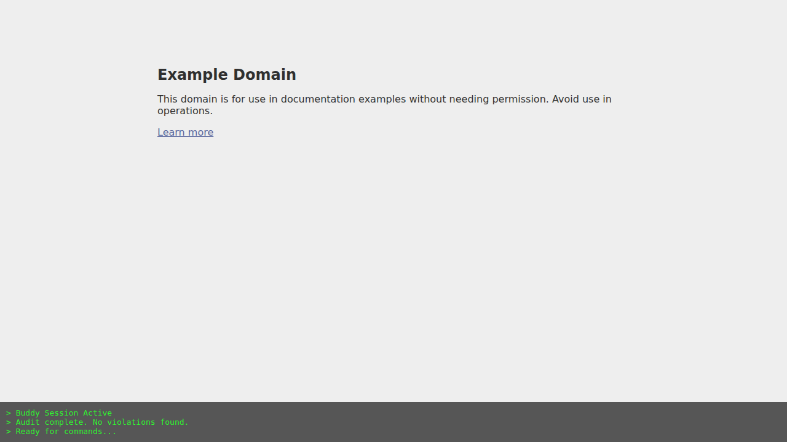

# Tester Buddy: User Guide for Manual Testers & Business Analysts

Welcome to **Tester Buddy**! This guide is designed to help you get started with using Tester Buddy for your exploratory testing sessions.

Tester Buddy is a command-line tool that launches a browser for you, automatically sets up the environment (like logging in as a specific user), and provides helpful utilities like accessibility auditing and session recording.



## Table of Contents

1.  [Prerequisites](#prerequisites)
2.  [Installation](#installation)
3.  [Quick Start](#quick-start)
4.  [Features & Commands](#features--commands)
5.  [Understanding Results](#understanding-results)
6.  [Troubleshooting](#troubleshooting)

---

## Prerequisites

Before you can use Tester Buddy, you need to have a few things installed on your computer.

### For Windows Users

1.  **Node.js**: Tester Buddy runs on Node.js.
    *   Download and install the **LTS version** from [nodejs.org](https://nodejs.org/).
    *   Follow the installation prompts (accept defaults).
2.  **Git** (Optional but recommended):
    *   Download from [git-scm.com](https://git-scm.com/download/win).
    *   This allows you to easily download the tool code.
3.  **Visual Studio Code** (Optional):
    *   A great editor for viewing code, but not strictly required. [Download here](https://code.visualstudio.com/).

### For Mac/Linux Users

1.  **Node.js**:
    *   We recommend using `nvm` (Node Version Manager) or Homebrew.
    *   **Homebrew**: `brew install node`
    *   **Manual**: Download from [nodejs.org](https://nodejs.org/).
2.  **Git**:
    *   Usually pre-installed on Mac. If not, run `xcode-select --install` in terminal.

---

## Installation

Once you have the prerequisites, follow these steps to set up Tester Buddy.

1.  **Open your Terminal** (Command Prompt or PowerShell on Windows, Terminal on Mac).
2.  **Download the Code**:
    *   If you have Git:
        ```bash
        git clone https://github.com/777abhi/tester-buddy.git
        cd tester-buddy
        ```
    *   *Alternative*: Download the ZIP file from the repository, unzip it, and open your terminal in that folder.
3.  **Install Dependencies**:
    *   Run the following command to install all necessary libraries:
        ```bash
        npm install
        ```
    *   This might take a minute. If you see warnings, don't worry, as long as it completes successfully.

---

## Quick Start

Let's start your first testing session!

1.  **Run the Tool**:
    In your terminal, run:
    ```bash
    npm run buddy -- --open --url https://example.com
    ```

2.  **What Happens?**
    *   A **Chromium browser window** will open and navigate to `https://example.com`.
    *   Your **terminal** will show that the session is active and ready for commands.
    *   **Note**: Do not close the terminal window! It controls the browser.

---

## Features & Commands

Tester Buddy offers several powerful features to speed up your testing.

### 1. Launching a Session
The basic command is `npm run buddy`. You can add "flags" to customize it.

*   `--open`: **Required** for interactive testing. Launches the browser.
*   `--url <website>`: Starts the browser at a specific website.
    *   *Example*: `npm run buddy -- --open --url https://google.com`

### 2. Simulating User Roles
If your application supports it, Tester Buddy can inject cookies or local storage to simulate being logged in as a specific user role.

*   `--role <role_name>`:
    *   *Example*: `npm run buddy -- --open --role admin`
    *   *Example*: `npm run buddy -- --open --role customer`

### 3. In-Session Commands
Once the browser is open and you are testing, you can type commands directly into the terminal window:

#### `audit`
Runs a quick accessibility and health check on the current page.
*   **Accessibility**: Checks for common accessibility violations (like low contrast, missing labels) using Axe Core.
*   **Console Errors**: Reports any JavaScript errors that happened in the browser console.

**How to use:**
1.  Navigate to the page you want to check in the browser.
2.  Switch to your terminal window.
3.  Type `audit` and hit Enter.
4.  Read the report in the terminal.

#### `exit`
Ends the session properly.
*   Closes the browser.
*   Saves a **Trace File** (recording of your session).

**How to use:**
1.  Type `exit` and hit Enter in the terminal.

---

## Understanding Results

Every time you finish a session (by typing `exit`), Tester Buddy saves a **Playwright Trace**.

*   **File Name**: `trace-<timestamp>.zip` (e.g., `trace-1678899000.zip`)
*   **Location**: The same folder where you ran the command.

### Viewing the Trace
The trace file contains screenshots, snapshots, and a timeline of everything you did. It's perfect for attaching to bug reports!

1.  Go to [trace.playwright.dev](https://trace.playwright.dev/).
2.  Upload the `.zip` file.
3.  You can now "replay" your session, see console logs, network requests, and more.

Alternatively, if you are comfortable with the command line:
```bash
npx playwright show-trace trace-<timestamp>.zip
```

---

## Troubleshooting

### "Command not found"
*   Ensure you have installed Node.js.
*   Ensure you are in the correct folder (`tester-buddy`).

### "Browser closed unexpectedly"
*   If you manually close the browser window, the session might end. Always use `exit` in the terminal to save your trace properly.

### "Address already in use"
*   If you see errors about ports, make sure you don't have another instance of Tester Buddy running.

---

*Happy Testing!*
